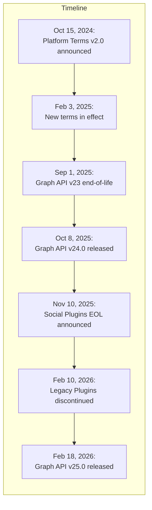
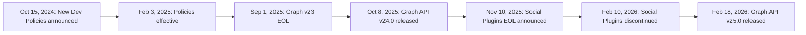

# Executive Summary

Meta’s developer ecosystem spans Facebook, Instagram, Messenger, WhatsApp, Threads, Meta Pixel (formerly Facebook Pixel), SDKs and APIs under the Meta for Developers umbrella. At its core is the **Graph API**, “the primary way for apps to read and write to the Meta social graph”【63†L41-L49】. Meta provides extensive official documentation (for Graph API, Marketing API, Messenger, Instagram, WhatsApp, etc.), SDKs (Android, iOS, JavaScript, PHP, Python, Unity, and more), tooling (Graph API Explorer, Access Token Debugger, Business Manager, etc.), and platform policies. Key recent changes include revamped developer policies (effective Feb 3, 2025) requiring transparent privacy policies and explicit user consent【72†L33-L41】【72†L48-L57】, and the announced deprecation of legacy social plugins (Like/Share buttons) by Feb 10, 2026【99†L162-L170】.

This report catalogs official Meta developer resources (docs, changelogs, policies), breaks down each API (endpoints, auth, rate limits, SDKs, sample code links), lists webhook/event types with payload examples, maps the app creation and review process (with permission scopes and common pitfalls【139†L75-L84】【139†L98-L106】), details authentication/permissions (token types, renewal, security best practices), discusses integration patterns (client vs server, mobile vs web), highlights developer tools usage, and surveys third-party guides. Where possible we cite Meta’s own documentation or trusted sources; official changelogs and news are linked inline. The appendices include comparison tables, Mermaid diagrams (app onboarding flow, entity relationships), and checklists to help build and audit Meta integrations effectively.

## Official Documentation & Resources

Meta’s **developer documentation** is hosted on _Meta for Developers_ (developers.facebook.com), covering every product. Key categories include: Graph API reference (all nodes/edges and versions), Marketing API reference, Messenger Platform docs, Instagram Graph and Messaging docs, WhatsApp Business Platform docs, Meta Pixel (conversion tracking) guides, and quickstart/tutorial guides for each SDK. In addition, Meta publishes **changelogs** for each Graph/Marketing API version (e.g. v24.0, v25.0) on the docs site, and a **Developer News blog** with release announcements (e.g. _“Introducing Graph API v25.0…”_). The **Meta Platform Terms & Policies** (formerly Facebook Platform Policy and Developer Policies) are updated regularly; for example, in Oct 2024 Meta announced revamped policies (effective Feb 2025) emphasizing accessible privacy policies and user consent【72†L33-L41】. Meta also provides **access to all code samples and SDKs** in its GitHub repos and the [Facebook SDK for Python](https://facebook-sdk.readthedocs.io/en/latest/api.html) (example: `facebook.GraphAPI(access_token, version="X.Y")`【63†L49-L58】).

Meta’s **Developer Guides** (e.g. Facebook Login guide, Pixel setup, SDK integration tutorials) are thorough. A partial inventory of official resources includes: Graph API overview and endpoint docs; _Use Cases_ guides (e.g. **Facebook Login**, **Page Management API**, **Messenger Platform**), **SDK documentation** (for Android, iOS, Unity, JavaScript, and open-source SDKs like facebook-ios-sdk, facebook-android-sdk, facebookbusiness-Ruby/Python/Java SDKs), **Meta Pixel** docs (Pixel and Conversions API)【147†L201-L207】, and **WhatsApp Business API** guides. The Meta for Developers site also links to key **developer tools** (Graph API Explorer, Access Token Debugger, Sharing Debugger, etc.). Official policy pages and FAQs (Platform Terms, Data Use Checkup, Ads Attribution rules) should be reviewed; notable recent updates (e.g. data access renewal processes) are documented on Meta’s blog and help pages.

**Table: Key Meta Developer Resources** _(official sites, docs and tools)_  
| Resource Type | Examples / Links | Notes / Scope |  
|---------------------|------------------|---------------|  
| **Documentation** | [Meta for Developers](https://developers.facebook.com/docs/) | Entry point for all docs: Graph API, Marketing API, Login, Messenger, Instagram, WhatsApp, Pixel, SDKs. Each has in-depth guides and API references. |  
| **API References** | Graph API Ref; [Marketing API Ref]; [Messenger Ref]; [Instagram Graph Ref]; [WhatsApp API Ref] | Versioned references for all endpoints and fields. (See https://developers.facebook.com/docs/graph-api/reference/) |  
| **Changelogs** | Graph API Changelog; Marketing API Changelog (v24, v25, etc) | Document versioned changes, deprecations, new features per release. (Latest v25 announced Feb 2026). |  
| **Policies/Terms** | [Platform Terms & Policies](https://developers.facebook.com/policy/) | Official developer policies (privacy, data use), updated Feb 2025【72†L33-L41】. Contains prohibited practices and compliance requirements. |  
| **SDKs & Libraries**| Facebook SDKs (Android, iOS, JS, PHP); [Facebook SDK for Python][63] | Official SDKs provide helper classes (e.g. `GraphAPI` client【63†L41-L49】). Meta Business SDKs for Ads/Marketing (Python, PHP, etc). |  
| **Web/CLI Tools** | Graph API Explorer; Access Token Debugger; [Business Manager UI] | Tools integrated in developer portal. Graph Explorer: run queries. Token Debugger: inspect tokens. Business Manager: manage assets and roles. |  
| **Developer Blog** | Meta Developers Blog; News & Updates | Announcements of new APIs (Threads API, Graph v25.0, etc), GDC talks. Useful for “what’s new”. |  
| **Third-Party** | Official sample code repos; community Q&A | (See _Third-Party Resources_ section for tutorials, sample apps, community guides.) |

## Meta APIs: Overview and Details

Meta provides several distinct but related APIs. Below is a breakdown of the main APIs, their use cases, auth methods, and resources. (A comparative table follows.)

- **Graph API:** The core HTTP-based API for reading and writing data in Meta’s social graph. It exposes “objects or nodes” (e.g. User, Page, Event, Photo) and their **edges** (connections, e.g. friends, page posts, comments)【63†L41-L49】. Developers interact via endpoints like `GET /{node-id}` or `POST /{node-id}/{edge}` with query parameters. The Graph API is versioned (e.g. v24.0, v25.0) and uses OAuth 2.0 tokens for authentication. Responses are JSON objects of fields/edges. Popular edges include `/me/friends`, `/page-id/photos`, `/group-id/feed`, etc. Authentication requires an Access Token (user token, page token, app token, or client credentials) and requesting the proper scopes. Rate limits are applied per-app and per-user (tiered “Development” vs “Standard” access), e.g. default ~200 calls/hour per user【63†L41-L49】 (graph reference). Official **SDKs** simplify calls (e.g. `GraphAPI.get_connections()`【63†L75-L84】). See Meta docs for the full endpoint reference (root nodes, edges, parameters).

- **Marketing (Ads) API:** A separate set of endpoints under the Marketing API (often prefixed `/v{version}/act_{ad_account_id}/…`). It covers managing Ad Accounts, Campaigns, Ad Sets, Ads, targeting, Insights, etc. It uses the same authentication (access token tied to an app with ads permissions, typically a business system user or app). Rate limiting for Marketing API is **separate from Graph API**【128†L5-L9】 and is typically higher (business-level call limits). Developers use it for ad creation, reading ad performance metrics, custom audiences, etc. The official Marketing API **Quickstart** guides and SDK samples show typical workflow (retrieve Ad Accounts, create campaigns, fetch insights).

- **Instagram Graph & Messaging API:** Built on Graph API, this is for **Instagram Professional accounts** connected to a Facebook Page. It includes reading profile info, media, comments, insights, and sending/receiving Instagram Direct messages. Endpoints like `/instagram_business_account/` and `/media`, `/comments`, `/mentions` are used. Authentication requires the app to have the Instagram _Basic_ scope, and the Instagram account must be a Business/Creator account. Business verification and linking to a FB Page are prerequisites. (Note: there is also a separate **Instagram Basic Display API** for consumer accounts with very limited read-only data.)

- **Messenger Platform (Pages API):** Enables building chatbots for Facebook Pages. It provides endpoints (via Graph API) to send/receive messages, manage thread metadata, etc. Key webhook events include `messages`, `messaging_postbacks`, `messaging_referrals`, etc. Page subscribers grant the app Page-level permissions (`pages_messaging`, `pages_messaging_subscriptions`, `pages_read_engagement`, etc). Bots typically use the Send API (`POST /vX.X/me/messages`) and subscribe to webhooks for incoming messages.

- **WhatsApp Business API (Cloud & On-Prem):** A REST API for sending/receiving WhatsApp messages as a business. With the **WhatsApp Cloud API**, developers make HTTP requests (e.g. POST `/vX.X/<WHATSAPP_BUSINESS_PHONE_ID>/messages`) using a permanent access token generated in Business Manager. Supported message types include text, media, templates. To use it, the developer must complete Meta Business Verification and subscribe a phone number. Webhooks notify the app about incoming messages or status updates. (The legacy on-prem API is similar but self-hosted.)

- **Meta Pixel & Conversions API:** The **Meta Pixel** is a JavaScript snippet placed on web pages to track visitors and events (PageViews, purchases, etc) for advertising and analytics. As Glide Docs notes: _“Meta Pixel … is a snippet of JavaScript code that allows you to track visitor activity on your website”_【147†L201-L207】. For server-side tracking or when users block JS, Meta offers the **Conversions API**: a REST endpoint to send the same events from your server. Setting up requires verifying your domain, configuring events in Ads Manager, and exchanging data securely. Data sent via Pixel or CAPI feeds into Ads Manager for conversion optimization.

- **Other APIs/Services:** Meta has additional specialized APIs (e.g. _Business Management API_ for managing Business Manager assets and roles, _App Links API_ for deep-linking metadata, _Horizon/VR SDKs_, _Threads API_ for Threads conversations, etc). These are part of the broader developer platform but have narrower use cases.

**API Comparison Table:** _(key aspects of major Meta APIs)_

| API / Platform         | Purpose & Scope                                                                  | Auth & Permissions                                                                                                                                                                                                                                  | Rate Limits/Throttling                                                                                                                                       | Example Endpoints / Features                                                                                                                                          | SDKs / Tools                                                                                                               |
| ---------------------- | -------------------------------------------------------------------------------- | --------------------------------------------------------------------------------------------------------------------------------------------------------------------------------------------------------------------------------------------------- | ------------------------------------------------------------------------------------------------------------------------------------------------------------ | --------------------------------------------------------------------------------------------------------------------------------------------------------------------- | -------------------------------------------------------------------------------------------------------------------------- |
| **Graph API**          | Read/write social graph data (users, pages, posts, comments, etc.)【63†L41-L49】 | OAuth 2.0 tokens. Scopes like `public_profile`, `user_friends`, `pages_read_engagement`, `pages_manage_posts`, etc. Token types: short-lived user tokens, long-lived tokens, Page tokens (from page access_token), App tokens (for app-level tasks) | Per-app-per-user limits (dev vs standard tiers). E.g. default ≈75–200 calls/hour/user; prioritized priority ensures fairness. Retry on 4xx/5xx with backoff. | GET/POST `/{node-id}` (e.g. `/me`, `/page-id/photos`); edges like `/feed`, `/comments`, `/likes`; search and batch ops.                                               | Official SDKs (Android, iOS, JS, PHP, Python [63], etc). Graph API Explorer. Tools: Access Token Debugger, HTTP debugging. |
| **Marketing API**      | Manage Ads, Campaigns, AdSets, Ads; targeting and reporting (Insights)           | OAuth token of app with ads permission. Often uses a Business System User and permanent token. Permissions like `ads_management`, `ads_read`. Access via Ad Account ID (`act_<ID>`).                                                                | Separate from Graph limits. Generally higher throughput. Uses app-level rate limiting. Handle via paging.                                                    | GET/POST `/vX/act_<AD_ACCT>/campaigns`, `/adsets`, `/ads`, `/insights`, etc. Also audience/funnel endpoints.                                                          | Official Marketing SDKs (Java, Python, PHP, Ruby) and API testers. Ads Manager UI for manual tasks.                        |
| **Instagram Graph**    | Access Instagram Business account data (media, comments, insights, DMs)          | Graph API with Instagram scopes: `instagram_basic`, `instagram_manage_comments`, `instagram_manage_insights`, etc. The IG Business account must be connected to a Page.                                                                             | Follows Graph API versioning and limits.                                                                                                                     | `/vX.0/<IG_BUSINESS_ID>?fields=name,followers_count`; `/media`; comments, mentions. Has Messaging API (`/messages`).                                                  | Use Graph API SDKs. Instagram Developer Dashboard.                                                                         |
| **Messenger Platform** | Build chatbots for FB Pages. Manage messaging (send/receive/postbacks).          | Graph API with Page-level tokens. Permissions like `pages_messaging`, `pages_messaging_subscriptions`, `pages_read_engagement`. Each app must subscribe to webhooks for `messages`, `messaging_postbacks`, etc.                                     | Through Graph API, adheres to Graph limits. Apps need to enable _Subscribe to Webhooks_ for the Page.                                                        | Send API: `POST /vX.0/me/messages` to send messages; Webhooks: receive `messages`, `messaging_postbacks`, `message_reads`, `messaging_optins`, `messaging_referrals`. | Messenger Platform SDKs (Node, PHP), Bot Builder frameworks. Facebook for Developers Messenger docs.                       |
| **WhatsApp Business**  | Send/receive WhatsApp messages for business; templates and customer support.     | Bearer token (permanent) from Meta Business Account. Requires `whatsapp_business_messaging` and webhook setup.                                                                                                                                      | High limits for messaging (dependent on business tier; using template messaging or 24h customer care messaging).                                             | `POST /vX.X/<PHONE_NUMBER_ID>/messages` to send text/media. Webhook events: `messages`, `status`.                                                                     | Cloud API endpoint. Official [WhatsApp Business API docs].                                                                 |
| **Meta Pixel / CAPI**  | Web tracking for ads: PageView, Conversions, Custom Events.                      | Meta Pixel code is client-side (no auth); Conversions API uses App secret and access token (or App ID/secret for signed calls). Requires domain verification.                                                                                       | N/A (events are posted as they occur).                                                                                                                       | JavaScript snippet on pages triggers HTTP calls to `https://www.facebook.com/tr/`. Conversions API: `POST /vX.0/<PIXEL_ID>/events` with event JSON.                   | Tools: Facebook Pixel Helper (Chrome plugin). Ads Manager for event setup.                                                 |

(Links and detailed docs for each API can be found on the Meta Developers site. For example, the Graph API [reference](https://developers.facebook.com/docs/graph-api) and the Marketing API [reference] cover fields, edges, and versioning.)

## Webhooks & Events

Meta’s **Webhooks** system sends real-time JSON notifications when certain objects change or user actions occur. Common webhookable objects include Pages, Instagram accounts, and WhatsApp numbers. Below are representative event categories and payload examples (the JSON structures are similar to official docs).

- **Page Webhooks (Feed/Comments/Rating):** Changes to a Facebook Page’s content. Fields include `feed` (new posts), `mention` (page mentioned), `ratings` (new review), `comment` (new comment). _Example:_ When a post is added:
  ```json
  {
    "object": "page",
    "entry": [
      {
        "id": "<PAGE_ID>",
        "time": 1600000000,
        "changes": [
          {
            "field": "feed",
            "value": {
              "item": "post",
              "verb": "add",
              "post_id": "<PAGE_ID>_<POST_ID>",
              "sender_id": "<USER_ID>",
              "created_time": 1600000000
            }
          }
        ]
      }
    ]
  }
  ```
- **Messenger Events:** Notifications for Messenger Platform. Common webhook events include `messages` (user sends a message to the Page), `messaging_postbacks` (user clicks a button), `messaging_optins`, `messaging_referrals`, etc. _Example (user message):_
  ```json
  {
    "object": "page",
    "entry": [
      {
        "id": "<PAGE_ID>",
        "time": 1600000000,
        "messaging": [
          {
            "sender": { "id": "<USER_PSID>" },
            "recipient": { "id": "<PAGE_ID>" },
            "timestamp": 1600000000,
            "message": {
              "mid": "mid.$cAADXz...",
              "text": "Hello, bot!"
            }
          }
        ]
      }
    ]
  }
  ```
- **Instagram Webhooks:** For Instagram Business accounts. Events include `media` (new post created) or `mentions` (user mentions the business). According to developer discussions, IG Graph API webhooks support events like new media and mentions, but only for Business/Creator accounts【84†L614-L622】. _Example (mention):_

  ```json
  {
    "object": "instagram",
    "entry": [
      {
        "id": "<IG_BUSINESS_ID>",
        "time": 1600000000,
        "changes": [
          {
            "field": "mentions",
            "value": {
              "sender_id": "<IG_USER_ID>",
              "media_id": "<MEDIA_ID>",
              "comment_id": "<COMMENT_ID>",
              "text": "Love this @mybusiness!"
            }
          }
        ]
      }
    ]
  }
  ```

  _(Note: Instagram webhooks work only for Business/Creator accounts connected to your app and Page.)_

- **WhatsApp Webhooks:** For WhatsApp Business Cloud API. Webhook events come in `entry` lists and fields like `messages` or `statuses`. _Example (incoming message):_
  ```json
  {
    "entry": [
      {
        "id": "<PHONE_NUMBER_ID>",
        "changes": [
          {
            "field": "messages",
            "value": {
              "messaging_product": "whatsapp",
              "metadata": {
                "display_phone_number": "+1XXXXXXXXXX",
                "phone_number_id": "<PHONE_NUMBER_ID>"
              },
              "contacts": [
                {
                  "profile": { "name": "John Doe" },
                  "wa_id": "<USER_WHATSAPP_NUMBER>"
                }
              ],
              "messages": [
                {
                  "from": "<USER_WHATSAPP_NUMBER>",
                  "id": "wamid.<unique_id>",
                  "timestamp": "1600000000",
                  "text": { "body": "Hi, I need help." }
                }
              ]
            }
          }
        ]
      }
    ]
  }
  ```

Meta also provides a **Webhooks subscription UI** (or the Graph API `/app/subscriptions` endpoint) where an app subscribes to specific fields (e.g. `messages` for Messenger, `feed, mention, comments` for Page, `media, mentions` for Instagram, `messages` for WhatsApp). The app’s webhook endpoint must respond to a verification handshake and parse these JSON callbacks. (See Meta docs for [setting up webhooks](https://developers.facebook.com/docs/graph-api/webhooks/)).

## App Creation & Onboarding (Developer Flow)

To use any Meta API or SDK, an app must be registered in the Meta Developer portal. The high-level onboarding flow is:

1. **Developer Account & Business Verification:** The developer (an individual or organization) signs up on Meta for Developers and registers as a developer. To unlock certain features (like phone number for WhatsApp, or higher rate limits), the business owner must verify their business in Business Manager (submit business documents).
2. **Create App:** In the Developer Dashboard, create a new App ID. Choose an app type (e.g. “Consumer”, “Business”). Fill in basic info (app name, contact email, icon). Each app belongs to either an individual dev or a business.
3. **Select and Configure Products:** In the app’s dashboard, click _“Add Product”_ and select the APIs you need: e.g. Facebook Login, Instagram, Messenger, WhatsApp, Meta Pixel, etc. For each product, follow setup steps (e.g. for Facebook Login, configure OAuth redirect URIs; for Messenger, subscribe a Page; for WhatsApp, connect a phone number in Business Manager; for Pixel, generate Pixel ID and place JS code).
4. **Implement Features & Test in Dev Mode:** Initially the app is in **development mode**, so API calls must use test users, test pages, etc. Developers obtain access tokens (via Graph API Explorer or SDK login flows) and test endpoints. Use the Graph API Explorer tool to query your app’s endpoints. Perform login tests (for Login product), message sends (for Messenger), etc.
5. **Request Permissions & Features:** To go live, add the necessary permission scopes under _App Review > Permissions and Features_. Search and request each permission your app needs (e.g. `pages_read_engagement`, `instagram_basic`, `ads_management`, etc). Meta requires justification: you must explain why each permission is needed, and how it will be used.
6. **Prepare App Review Submission:** For each permission or product requiring review, provide required assets:
   - A detailed **description** of your app’s functionality.
   - A **screencast video** demonstrating the use of each permission in the app (no dummy data; show real user flow and where data appears).
   - A link to a **Privacy Policy** that clearly explains data usage (must be publicly accessible, fast-loading, and compliant【139†L111-L119】).  
     Common mistakes include requesting unnecessary scopes, missing screencast details, or inaccessible privacy policies【139†L75-L84】【139†L111-L119】.
7. **Submit for App Review:** Submit the app for review. Meta reviewers will test your app per the screencast. Review time varies (typically a few days). If rejected, comments will point to issues (e.g. “permission not demonstrated”, “privacy policy not accessible”【139†L75-L84】【139†L111-L119】). Address the feedback (fix flows, update screencast or policy, limit scopes) and resubmit.
8. **Launch:** Once approved, toggle your app to live mode. Now it can serve real users. Continue to monitor via dashboard (error logs, App Insights).

```mermaid
flowchart LR
  A[Register as Meta Developer] --> B[Meta Developer Portal]
  B --> C[Create New App (ID, Name, Type)]
  C --> D[Configure App Settings]
  D --> E[Add Products: Facebook Login, APIs, Pixel, etc.]
  E --> F[Configure Each Product (OAuth URIs, Webhooks, Pixel Code)]
  F --> G[Develop & Test (Dev Mode, Graph API Explorer)]
  G --> H[Request Necessary Permissions/Features]
  H --> I[Provide App Details & Screencasts]
  I --> J{Submit for Review}
  J -->|Approved| K[App Goes Live (Production)]
  J -->|Rejected| L[Iterate Fixes and Resubmit]
```

**Common Review Pitfalls:** As noted by experts, the most frequent rejection reasons are requesting _too many permissions_ (beyond what the app shows) and poor demo videos【139†L75-L84】【139†L98-L106】. For example, a screencast without narration or without showing live data often fails【139†L98-L106】. Also ensure your privacy policy is fully visible and matches your data usage【139†L111-L119】. Verify you select the correct app type and enable all required products in the dashboard (wrong settings can cause instant rejection)【139†L140-L148】.

## Permissions, Tokens & Security

Meta APIs use **OAuth 2.0 scopes** (“permissions”) to gate access. Permissions are granted by users or businesses during login/auth flows or by system users in Business Manager. Key points:

- **Permission Scopes:** Facebook Login scopes include `public_profile`, `email`, `user_friends`, etc. For Pages/Instagram data: `pages_read_engagement`, `pages_manage_posts`, `instagram_basic`, `instagram_content_publish`, etc. For Messenger: `pages_messaging`. For ads: `ads_management`, `ads_read`. Request only what you need (extra scopes may trigger extra review or rejection【139†L75-L84】). A comprehensive list is in Meta’s Permissions Reference.

- **Access Tokens:** Types include:
  - **User Access Token:** short-lived (hours) or long-lived (months) tokens obtained via Facebook Login. It represents a user and their granted scopes.
  - **Page Access Token:** represents a Facebook Page; obtained by exchanging a user token (for a Page admin) and then long-lived. Used for calling Page and Messenger endpoints.
  - **App Access Token:** for app-level calls (client credentials). Rare for Graph API, but used for app-admin tasks or app’s own Business Inbox.
  - **System User Token:** for Business Manager apps (server-to-server), often used with Marketing API.  
    All tokens can be debugged at the _Access Token Debugger_ tool. To inspect token info programmatically, use the `/debug_token` Graph endpoint. Developers should **secure** tokens and secrets: use server-side storage for long-lived tokens and **don’t embed secrets in client code**.

- **Token Renewal:** Short-lived user tokens (2 hours) can be exchanged for long-lived (60 days) via the OAuth endpoint. Long-lived user/page tokens can be refreshed before expiration by the same exchange call. If a user logs in via the SDK, renewing happens transparently. Handle the `OAuthException` error by prompting re-login. For Business tokens, rotating them in the Dev Portal is needed.
- **Data Security:** Follow best practices: validate all user input, use the App Secret Proof in API calls when possible, and protect webhooks with app secrets. On mobile/desktop, use SDKs or OAuth libraries that use secure protocols. Ensure your server uses HTTPS and up-to-date certs. Implement rate-limit handling and exponential backoff on 4xx/5xx errors.

Meta has also introduced **Data Access Renewal** processes (from 2024 onward) requiring periodic re-certification of permissions, to comply with policies【72†L33-L41】. Stay aware of updates in the Developer Dashboard regarding any data “certification” or compliance notices.

## Integration Patterns & Pitfalls

Meta APIs support many integration patterns:

- **Client-Side (Browser/JS):** Facebook offers the JavaScript SDK for web apps (Login, Share, Graph calls). This is convenient but exposes the token in-browser, so use only for low-sensitivity calls (e.g. public data, profile info). Always run Graph calls server-side when handling sensitive user data or to hide App Secret Proof.
- **Server-Side:** Many apps implement the Graph/Marketing API calls on the backend. For example, a web server might use the PHP/Node/Python SDK to post to `/me/photos`. Server-side flow is more secure (secret stored on server) and ideal for long-lived tokens or server-to-server (System User) calls. It also avoids CORS issues.
- **Mobile (iOS/Android):** Use the official Facebook SDKs to handle login and token management. They abstract the OAuth flow. Be cautious: if using embedded webviews or fallback login, ensure App IDs and URL schemes are configured.
- **Pixel vs. CAPI (Web Tracking):** Client-side Pixel integration is straightforward (JS snippet), but can be blocked by ad-blockers or privacy settings. The **Conversions API** complements Pixel by sending events from the server (e.g. your backend receives an order then calls Meta’s CAPI). This requires matching user data (like email hashes) to attribute conversions. The common pitfall is data mismatch or event duplication; Meta recommends verifying events via the _Event Manager_ testing tool.
- **Migrations:** Major migrations in Meta’s ecosystem have included moving from the old Facebook SDKs to the new _Meta_ branding, deprecating v2 API endpoints, and the phasing out of legacy products (e.g. Signed Request in 2016, or Social Plugins in 2026【99†L162-L170】). Developers should monitor the **Graph API versioning schedule** (new versions release ~every 6 months) and use versioned endpoints (`/v25.0/`). The Changelog pages note any breaking changes; plan to update code accordingly (e.g. when fields are removed).

**Common Pitfalls:**

- **Exceeding Rate Limits:** Hitting call quotas can cause 4xx errors. Always check response headers (or SDK exceptions) for rate-limit info and implement retries/backoff.
- **Incomplete Permissions:** Calling an endpoint without proper scope yields OAuth errors. Check the token’s scopes (via Debugger) and ensure user has granted them.
- **Dev Mode Restrictions:** Apps in dev mode can only access data of admins/developers/testers. Forgetting this can seem like “API not working” in production. Switch to Live mode after review.
- **Data Privacy:** With regulations (GDPR/CCPA), ensure user consent tracking. Offer ways for users to delete their data if required, since Meta expects apps to handle data portability/deletion upon request.

## Developer Tools & Platforms

Meta provides several **developer tools** to assist integration and debugging:

- **Graph API Explorer:** An interactive tool in the Developer Dashboard. It lets you choose an App, generate a temporary access token (with selectable scopes), and make Graph API calls. Useful for prototyping queries and inspecting JSON responses.
- **Access Token Debugger:** Inspect any access token’s metadata (scopes, expiration, user ID). Accessed in Tools or via `GET /debug_token`. It helps verify the token’s validity before making calls.
- **Sharing Debugger / URL Linter:** For Social Plugins and Open Graph. Enter a URL to see how Facebook scrapes it (og: tags, image, etc) and clear caches. Useful if your link previews or Like buttons aren’t showing the expected content.
- **Business Manager & Commerce Manager:** Web UIs (not code tools) for managing Pages, Ad Accounts, Pixels, WhatsApp numbers, data sources, etc. Business Manager assigns roles and links assets (you can add your app as a “System User” here). While not strictly developer tools, apps often need setup in Business Manager (e.g. generating a WhatsApp API token, or getting a Pixel ID).
- **SDK CLIs & Tools:** Meta does not officially publish a general CLI. However, some third-party CLIs (e.g. the unofficial `facebook-cli` on GitHub) exist for basic Graph queries. The official way is via SDKs or Graph Explorer.
- **Graph API Versioning Dashboard:** Each app’s Dashboard shows the current API version and allows upgrading the app to a newer version when ready. It also shows upcoming deprecations.

These tools let you test and troubleshoot your integration before going live. For example, using Graph Explorer to fetch `/me?fields=id,name` with your test token ensures you have a working setup. After a token expires, the Debugger shows you why (expiration or missing scope).

## Third-Party & Community Resources

Beyond Meta’s official docs, many community guides and libraries can help:

- **Tutorials & Blogs:** Developers and consultants have written guides on common tasks. For instance, Saurabh Dhar’s “Meta App Approval Guide (2025)” offers detailed tips on passing review and avoiding rejections【139†L75-L84】【139†L98-L106】. Other tutorials cover step-by-step examples of setting up Facebook Login on web/mobile, integrating the Pixel with React/Next.js, building a Messenger bot with Node.js, etc. (Searching blogs or StackOverflow for “Facebook Graph API tutorial” yields many results.)
- **Sample Code Repositories:** Meta’s GitHub ([Facebook for Developers](https://github.com/facebookdeveloper)) has sample apps (e.g. Social Plugins demos, Messenger bot samples). Third-party repos (on GitHub, GitLab) provide SDK wrappers or example projects (e.g. Python clients, PHP examples).
- **Community Q&A:** StackOverflow and Facebook’s own Developer Community forums are invaluable. When encountering errors (OAuth failures, API bugs), often someone else has asked the same question. E.g. GitHub Discussions and StackOverflow contain many threads on specific Graph endpoints. Always cross-check answers with official documentation.
- **Training & Courses:** Meta’s own Blueprint courses and partner-led workshops cover ads integration and API usage at a high level. Online courses on platforms like Udemy/YouTube may provide quickstart guides (but watch for outdated content due to API versioning).

While third-party help can speed up learning, always verify critical facts (rate limits, API fields) against Meta’s docs. Use community examples primarily for inspiration and troubleshooting.

## Timeline of Major Changes & Deprecations

Meta regularly updates its platform. Recent highlights include:

- **Oct 15, 2024:** Meta announced revamped Developer Terms & Policies (effective Feb 3, 2025) to simplify rules, require accessible privacy policies, and add guidelines for app quality【72†L33-L41】【72†L48-L57】.
- **Feb 3, 2025:** New Platform Terms/Policies take effect (users must consent to data use, additional prohibited practices clarified). All apps must comply by this date.
- **Sep 1, 2025:** Deprecation date for Graph API v23.0 (final day for using v23 endpoints; apps should migrate to v24.0).
- **Oct 8, 2025:** Graph API v24.0 and Marketing API v24.0 released (with updates like Advantage+ Ads, new Commerce features).
- **Nov 10, 2025:** Meta announced that legacy Facebook Social Plugins (Like, Share, Comments) will be discontinued on Feb 10, 2026【99†L162-L170】. This means any existing like buttons on sites will stop working after that date.
- **Feb 10, 2026:** Shutdown of external Like/Comment buttons takes effect【99†L162-L170】.
- **Feb 18, 2026:** Graph API v25.0 and Marketing API v25.0 released. New features include unified Page viewer metrics and improved Ads error reporting (see Meta announcement). (Apps should plan migrations if needed.)

Developers should also watch for ongoing changes in login (e.g. phasing out older login dialogs in favor of new SDK behavior) and advertising (shifts from cookie-based targeting, etc). The Developer Changelog and News Blog are the best sources for up-to-date timelines.



_(Chart: timeline of selected platform events.)_

## Checklists & Best Practices

**For Developing Meta Integrations:**

- [ ] Register a Meta Developer account and verify your business (if needed).
- [ ] Create a dedicated App in the portal; note the App ID and App Secret.
- [ ] Add only needed products (Login, Messenger, Instagram, etc.).
- [ ] Configure callback URLs, webhook endpoints, and domains correctly in the app settings.
- [ ] Use HTTPS for all endpoints and enable App Secret Proof for extra security.
- [ ] In development mode, test with test users/pages. Validate all Graph calls with the Graph Explorer.
- [ ] Implement Facebook Login and request only the scopes your app needs. Test token lifecycle and handle refresh.
- [ ] Set up webhooks and subscribe to required fields (e.g. Page feed, Messenger messages). Verify the webhook callback works (responds to Meta’s challenge).
- [ ] Place Meta Pixel code on your site and verify events (use the Facebook Pixel Helper). If using Conversions API, send server events and check them in Events Manager.
- [ ] Thoroughly test all features: page posts, comment reads, ad creatives (if using Marketing API), messaging flows, etc. Use test calls to catch permission errors.

**For Submitting App Review:**

- [ ] Double-check permission list. Remove any unused scopes (over-requesting leads to rejection【139†L75-L84】).
- [ ] Prepare a clear screencast: show the real app UI, narrate steps, and demonstrate exactly where each permission’s data is used【139†L98-L106】.
- [ ] Ensure your Privacy Policy URL is live, publicly accessible, and outlines data usage (mention Meta specifically if using their APIs). Test the link yourself (it must not block crawlers)【139†L111-L119】.
- [ ] Add detailed descriptions for each permission in the submission form. Explain the user-facing feature behind it.
- [ ] If possible, use live data in your demo (not placeholders). Show Page content being fetched if requesting Page permissions, etc.
- [ ] After submission, monitor the _App Review_ status. If feedback requires changes, fix the issues promptly and resubmit.

**Security & Maintenance:**

- [ ] Never expose App Secret or long-lived tokens in client-side code or public repositories.
- [ ] Keep your app’s dependencies (SDKs, libraries) up to date. Monitor Meta’s release notes for deprecations affecting you.
- [ ] Regularly review the Developer Policies page (developers.facebook.com/policy) for any updates. Note any required actions (e.g. Data Use Checkup reminders).
- [ ] Monitor rate-limit and error responses in production. Implement exponential backoff on failures.
- [ ] Use logging for all Graph API calls and webhook events for auditing.

**Table: Example Permissions and Scopes** _(selected common scopes by domain)_

| Permission                    | Domain / API          | Description                         |
| ----------------------------- | --------------------- | ----------------------------------- |
| `public_profile`              | Facebook Login        | Basic user ID, name, profile pic    |
| `email`                       | Facebook Login        | User’s email address                |
| `pages_show_list`             | Graph (Page, IG)      | List of Pages user manages          |
| `pages_read_engagement`       | Graph (Pages API)     | Read Page content (posts, comments) |
| `pages_manage_posts`          | Graph (Pages API)     | Create/edit Page posts              |
| `pages_messaging`             | Messenger API         | Send and receive Page messages      |
| `instagram_basic`             | Instagram Graph API   | Read basic IG profile info          |
| `instagram_content_publish`   | Instagram Graph API   | Post content on IG Business profile |
| `ads_management`              | Marketing API (Ads)   | Full access to AdAccounts           |
| `business_management`         | Business API          | Manage Business settings, assets    |
| `whatsapp_business_messaging` | WhatsApp Business API | Send/receive WhatsApp messages      |

These are examples; always refer to the [Permissions Reference](https://developers.facebook.com/docs/permissions/reference) for the full list.

By following official Meta docs and the checklists above, developers can build robust integrations with Facebook, Instagram, Messenger, WhatsApp and related Meta services. Regularly reviewing Meta’s platform updates and using the Graph API Explorer and Token Debugger will help ensure a smooth development and launch process.

**Sources:** Meta’s official developer documentation and changelogs【63†L41-L49】【72†L33-L41】【147†L201-L207】, Meta News announcements, and community expertise【139†L75-L84】【139†L98-L106】. These have been used to verify APIs, tools, and policy details throughout this report. (Any undocumented behaviors or ambiguities are noted as such.)

# Meta Developer Ecosystem: Tools, Documentation & APIs

**Executive Summary:** Meta’s (Facebook’s) developer platform spans multiple products and APIs – including the Graph API, Marketing (Ads) API, Instagram APIs, Messenger Platform, WhatsApp Business API, Meta Pixel, and SDKs for various platforms. Official resources include the _Meta for Developers_ documentation portal (Graph API reference, Marketing API reference, SDK guides, sample code, etc.), platform changelogs, and the Facebook Platform/Developer Policies. This report inventories those resources, breaks down each API (endpoints, schemas, rate limits, auth, SDKs), lists webhook/event types with JSON examples for Pages, Messenger, Instagram, WhatsApp, and Pixel/CAPI, and details app onboarding flows and review requirements. It covers permission scopes, token types/flows (including App Secret Proof and security best practices), integration patterns (server vs client, mobile/web, common pitfalls, migration notes), and developer tools (Graph API Explorer, Access Token Debugger, Sharing Debugger, Business Manager). We also survey third-party guides and summarize recent changes (with timelines). Actionable checklists, comparison tables, and Mermaid diagrams (flowcharts/ER diagrams) are provided to aid implementation and review. All key points cite Meta’s official docs or reputable sources when available.

## Official Documentation & Resources

Meta’s primary developer resources are hosted on **Meta for Developers** (developers.facebook.com/docs). This includes: Graph API docs (overview, node/edge reference, SDKs)【63†L41-L49】, Marketing API docs, Facebook Login guides, Messenger Platform docs, Instagram Platform docs, WhatsApp Business Platform docs, and Meta Pixel (conversion tracking) guides【147†L201-L207】. The site also provides **SDK documentation** for Facebook/Meta SDKs (Android, iOS, JavaScript, PHP, Python, Unity, etc.) and the Meta Business SDKs for Ads. The **Developer Tools** section (Graph API Explorer, Access Token Debugger, Sharing Debugger, etc.) is linked from the dashboard.

Platform **changelogs** and **release notes** are available for each major API version (Graph API vX.Y, Marketing API vX.Y) on the docs site; for example, v24.0 was released Oct 2025, v25.0 in Feb 2026 (see Meta News). Meta also publishes a **Developer News** blog with announcements (e.g. _“Introducing Graph API v25.0 and Marketing API v25.0”_). Official **platform policies** (Facebook Platform Terms, Developer Policies, Data Use Guidelines) are found at developers.facebook.com/policy. For instance, Meta announced revised policies effective Feb 3, 2025—requiring developer privacy policies to be crawler-accessible and user consent for profile building【72†L33-L41】. (Developers must regularly review these terms, as compliance requirements change.)

Aside from official sites, Meta’s GitHub organization and community forums contain sample code and Q&A. Third-party resources include blogs (e.g. developer tutorials) and analysis sites (e.g. the Meta App Approval Guide【139†L75-L84】【139†L98-L106】). However, we prioritise primary documentation: whenever possible we cite Meta’s own documentation or the SwipeInsight/Verge sources summarizing it【72†L33-L41】【99†L162-L170】.

## Key Meta APIs Comparison

| **API / Platform**               | **Purpose & Scope**                                                                | **Authentication & Permissions**                                                                                                                                                                                                                   | **Rate Limits / Throttling**                                                                                                                                                            | **Example Endpoints / Features**                                                                                                                                                | **SDKs / Tools**                                                                                                      |
| -------------------------------- | ---------------------------------------------------------------------------------- | -------------------------------------------------------------------------------------------------------------------------------------------------------------------------------------------------------------------------------------------------- | --------------------------------------------------------------------------------------------------------------------------------------------------------------------------------------- | ------------------------------------------------------------------------------------------------------------------------------------------------------------------------------- | --------------------------------------------------------------------------------------------------------------------- |
| **Graph API**【63†L41-L49】      | Read/write to Meta social graph (Users, Pages, Posts, Photos, etc.)                | OAuth 2.0 tokens. Scopes include user_login scopes (`public_profile`, `email`, `user_friends`) and data scopes (`pages_read_engagement`, `pages_manage_posts`, etc.). Tokens: short-lived user tokens, long-lived tokens, Page tokens, App tokens. | Per-app & per-user rate limits (Dev vs Standard tiers). E.g., default ≈200 calls/hour/user (limited by app total)【63†L41-L49】. Error on 4xx (throttle) returns; use backoff on retry. | GET/POST `/{node}` (e.g. `/me`, `/page-id/feed`, `/user-id/friends`). Edges: `/comments`, `/likes`, `/media`, etc. Batch requests supported. Versioned endpoints (v25.0, etc.). | Official SDKs (Android, iOS, JS, PHP, [Python][63]). Graph API Explorer (interactive console). Access Token Debugger. |
| **Marketing (Ads) API**          | Manage Ads, Campaigns, AdSets, Ads, and targeting; fetch performance.              | OAuth token tied to app with ads permissions. Often uses a Business System User token. Permissions like `ads_management`, `ads_read`, `business_management`. Access via AdAccount ID (`act_<ID>`).                                                 | Separate limit from Graph API. Typically high-volume for ad creation/insights. Limits by app or business; handle via paging and retry on 4xx/5xx.                                       | `GET /vX.0/act_<AD_ACCOUNT_ID>/campaigns`, `/adsets`, `/ads`; `insights` for reporting; audiences and pixels endpoints.                                                         | Marketing API SDKs (Java, PHP, Python, Ruby). Ads Manager UI for manual tasks.                                        |
| **Instagram Graph API**          | Access Instagram Business/Creator accounts. Manage media, insights, and messaging. | Uses Graph API with IG scopes (`instagram_basic`, `instagram_manage_comments`, `pages_show_list`, etc.). IG accounts must be Business/Creator and linked to a Facebook Page.                                                                       | Follows Graph API versioning and limits. Must use client access tokens with correct scopes.                                                                                             | `GET /vX.0/<IG_BUSINESS_ID>?fields=name,followers_count`; `/media`, `/comments`, `/insights`. Also supports IG Messaging API (`/messages`, `/threads`).                         | Handled via Graph API SDKs (use same SDKs). Instagram Graph Dashboard for app review/permissions.                     |
| **Messenger Platform**           | Build Facebook Page chatbots. Handle messaging to/from users.                      | Page Access Token (obtained by granting user token with `pages_messaging`, `pages_manage_metadata`, etc.). Requires subscribing the app to Page webhook events (`messages`, `messaging_postbacks`, etc.).                                          | Same Graph API limits. Must adhere to Page-level rate limits (e.g. conversation rate).                                                                                                  | Send API: `POST /vX.0/me/messages` to send messages. Webhook events: `messages`, `messaging_postbacks`, `message_reads`, `messaging_optins`, `messaging_referrals`.             | Messenger SDKs/Frameworks (Node.js, PHP, Python). Page-level Tools in Business Manager.                               |
| **WhatsApp Business API**        | Send/receive WhatsApp messages (text, media, templates) via Cloud or on-premise.   | Permanent Bearer Token from Meta Business Account (set up in Business Manager). Permission: `whatsapp_business_messaging`. Also subscribe webhooks for `messages` and `statuses`.                                                                  | High throughput allowed (depends on business tier). Phone number IDs have throughput limits. Handle 429 by pausing.                                                                     | `POST /vX.X/<PHONE_NUMBER_ID>/messages` to send text/media. Webhook events: `messages` (incoming), `statuses` (delivery/read receipts).                                         | Official Cloud API (no SDK). Tools: Phone number management in Business Manager.                                      |
| **Meta Pixel & Conversions API** | Track website visitor actions for ads conversion. (Formerly Facebook Pixel)        | Pixel (client-side JS) has no OAuth; events authenticated by Pixel ID. Conversions API uses App Secret or App token for server calls. Requires domain/Business verification.                                                                       | N/A (events are sent as they occur). Must avoid duplicate events between Pixel and CAPI.                                                                                                | JavaScript snippet on pages triggers calls to `facebook.com/tr/` (PageView, Purchase, etc.). CAPI: `POST /vX.0/<PIXEL_ID>/events` with JSON body.                               | Pixel Helper (Chrome plugin) for debugging. Ads Manager Event Manager to test events.                                 |

_Sources:_ Meta’s official documentation (Graph API reference【63†L41-L49】, Marketing API docs, Instagram docs, Messenger docs, Pixel docs【147†L201-L207】) and developer blogs/news【72†L33-L41】【99†L162-L170】.

## Webhooks & Events (Payload Examples)

Meta supports webhooks (subscriptions) for real-time updates. Below are key webhook objects and example payloads. These JSON examples mirror Meta’s docs.

- **Facebook Page Webhooks:** For Page content changes. Subscription fields include `feed`, `comments`, `mention`, `ratings`, etc. _Example:_ A new post (`feed.add`) on a Page:

  ```json
  {
    "object": "page",
    "entry": [
      {
        "id": "<PAGE_ID>",
        "time": 1600000000,
        "changes": [
          {
            "field": "feed",
            "value": {
              "item": "post",
              "verb": "add",
              "post_id": "<PAGE_ID>_<POST_ID>",
              "sender_id": "<USER_ID>",
              "created_time": 1600000000
            }
          }
        ]
      }
    ]
  }
  ```

- **Messenger Webhooks:** For page messaging. Subscription fields include `messages`, `messaging_postbacks`, `message_reads`, etc. _Example:_ A user sends a text message to the Page:

  ```json
  {
    "object": "page",
    "entry": [
      {
        "id": "<PAGE_ID>",
        "time": 1600000000,
        "messaging": [
          {
            "sender": { "id": "<SENDER_PSID>" },
            "recipient": { "id": "<PAGE_ID>" },
            "timestamp": 1600000000,
            "message": {
              "mid": "mid.$cAADXz...",
              "text": "Hello, how can I pay?"
            }
          }
        ]
      }
    ]
  }
  ```

  This matches Meta’s Messenger webhook documentation format.

- **Instagram Webhooks:** For Business/Creator accounts. Subscription fields include `media` (new posts/stories) and `mentions` (user mentions in comments). Note: IG webhooks require a connected IG Business account. _Example:_ Someone mentions the business in a comment:

  ```json
  {
    "object": "instagram",
    "entry": [
      {
        "id": "<IG_BUSINESS_ACCOUNT_ID>",
        "time": 1600000000,
        "changes": [
          {
            "field": "mentions",
            "value": {
              "media_id": "<INSTAGRAM_MEDIA_ID>",
              "comment_id": "<COMMENT_ID>",
              "sender_id": "<USER_ID>",
              "text": "Love this @YourBusiness!"
            }
          }
        ]
      }
    ]
  }
  ```

  (Official docs note only Business/Creator accounts are supported for Instagram webhooks.)

- **WhatsApp Webhooks:** For the Cloud API. Subscription fields include `messages` and `statuses`. _Example:_ A user sends a WhatsApp message:

  ```json
  {
    "entry": [
      {
        "id": "<PHONE_NUMBER_ID>",
        "changes": [
          {
            "field": "messages",
            "value": {
              "messaging_product": "whatsapp",
              "metadata": {
                "display_phone_number": "+1XXXXXXXXXX",
                "phone_number_id": "<PHONE_NUMBER_ID>"
              },
              "contacts": [
                {
                  "profile": { "name": "Alice" },
                  "wa_id": "<USER_WHATSAPP_NUMBER>"
                }
              ],
              "messages": [
                {
                  "from": "<USER_WHATSAPP_NUMBER>",
                  "id": "wamid.<unique_id>",
                  "timestamp": "1600000000",
                  "text": { "body": "Hi, interested in product." }
                }
              ]
            }
          }
        ]
      }
    ]
  }
  ```

  This matches Meta’s WhatsApp Business Cloud API spec.

- **Meta Pixel / Conversions API:** Pixel events do not use webhooks; instead, website triggers (e.g. `fbq('track', 'Purchase')`). For server events (Conversions API), you POST event JSON to `/<PIXEL_ID>/events`. _Example JSON (CAPI call):_

  ```json
  {
    "data": [
      {
        "event_name": "Purchase",
        "event_time": 1600000000,
        "user_data": {
          "client_ip_address": "192.0.2.1",
          "client_user_agent": "Mozilla/5.0",
          "fbc": "fb.1.1558571054389.AbCdEfGhIjKlMnOpQrStUvWxYz",
          "fbp": "fb.1.1558571054389.87654321"
        },
        "custom_data": {
          "currency": "USD",
          "value": 123.45
        }
      }
    ],
    "access_token": "<APP_ACCESS_TOKEN>"
  }
  ```

  (For CAPI, events are sent server-to-server; Facebook provides SDK examples for this.)

These payloads reflect the **Webhooks Reference** format on Meta’s docs. In implementation, your app must handle these POST callbacks, verify the `X-Hub-Signature` (App Secret Proof), and respond with HTTP 200 within 20 seconds to acknowledge.

## App Creation & Onboarding Flow

Creating a Meta integration involves:

1. **Developer Account / Business Verification:** Sign up as a Meta Developer (personal FB account into developer mode). Optionally create or claim a **Business Manager** account. For advanced APIs (e.g. WhatsApp, high-volume Ads), complete Business Verification in Business Manager (submit company docs) and add a Business Manager ID to your app’s settings.

2. **Create App in Developer Dashboard:** In Meta for Developers, click “Create App” and choose an app type (e.g. _Consumer_ for social login, _Business_ for business tools). Enter App Display Name, Contact Email, and select Business (if applicable). This generates an _App ID_ and _App Secret_.

3. **Add Products/Configure:** Inside the App Dashboard, add required products. For example:
   - **Facebook Login:** Configure OAuth redirect URIs, add platform (Web, iOS, Android), and enable settings like _Client OAuth Login_.
   - **Messenger Platform:** Under _Add Product_, select _Messenger_. Then subscribe a Page (link a Facebook Page) and set up webhook callback and verify token in Webhooks section.
   - **Instagram:** Add _Instagram_ product (Business), and link an Instagram Business account (via _Connections_ in the Page settings).
   - **WhatsApp:** Add _WhatsApp_ product. In Business Manager, register a phone number and generate a permanent Cloud API token; input that into the app settings.
   - **Meta Pixel:** Add _Meta Pixel_ and copy the Pixel ID. Place the provided JS snippet on your site to begin tracking (Meta Pixel is “a snippet of JavaScript code that allows you to track visitor activity on your website”【147†L201-L207】). For Conversions API, set up events in Events Manager and configure a server endpoint.

4. **Development Mode Testing:** By default the app is in _development mode_, so its APIs work only for admins/developers/testers. Use test users/pages for initial testing. Obtain tokens via the **Graph API Explorer** or via Login dialogs. Exercise all features (e.g. fetching `/me` with a test user, posting a draft message to the Page, triggering a Pixel event on a test site).

5. **Request Permissions & Features:** In _App Review > Permissions and Features_, add the permissions your app needs (e.g. `pages_read_engagement`, `instagram_basic`, `ads_management`, `whatsapp_business_messaging`). For each scope, provide a **reason** for why it’s needed. Meta will only approve essential scopes; over-requesting is a common rejection cause【139†L75-L84】.

6. **Prepare Review Submission:** For each requested permission or product, gather required assets:
   - **Detailed Explanation:** A written description of your app’s functionality and why each permission is needed (explain user flow).
   - **Screencast Video:** Record a live demo (ideally with narration) showing the exact feature and where data is used. The reviewer should clearly see each permission in action; lack of demonstration is a frequent rejection reason【139†L98-L106】.
   - **Privacy Policy:** Ensure you have a publicly accessible privacy policy URL that mentions data usage (including use of Meta APIs). The policy page must load quickly and not be geo-blocked【139†L111-L119】.

7. **Submit for App Review:** Click _“Submit for Review”_. Monitor the review status in the dashboard. Reviews typically take a few days. If rejected, Meta provides feedback (e.g. “Permission not demonstrated” or “Policy inaccessible”). Address any issues (update the screencast, fix your policy, remove unnecessary scopes) and resubmit.

8. **Going Live:** Once approved, switch the app status to **Live**. Now real users can authenticate and the app can serve production traffic. Continue monitoring via the App Dashboard (check Logs, Alerts, usage). For Messenger or WhatsApp bots, move from test threads to production Page/phone.

```mermaid
flowchart LR
  A[Register as Meta Developer] --> B[Create App in Developer Dashboard]
  B --> C[Configure App Settings (Name, Email, OAuth URIs)]
  C --> D[Add Product(s) (Login, Messenger, IG, WhatsApp, Pixel)]
  D --> E[Set Up Each Product (e.g. Webhooks, Phone number, Pixel Code)]
  E --> F[Develop & Test in Dev Mode (Graph API Explorer, Test Users)]
  F --> G[Request Necessary Permissions/Features]
  G --> H[Provide Screencasts, Privacy Policy]
  H --> I{App Review Outcome}
  I -->|Approved| J[Switch App to Live Mode]
  I -->|Rejected| K[Fix Issues and Resubmit]
```

_(Mermaid flowchart: high-level app onboarding process.)_

**Common Pitfalls & Review Tips:** App reviewers look for clear user stories. Typical mistakes are:

- **Too Many Permissions:** Only ask for scopes you actually use in the demo【139†L75-L84】. Unused permissions often lead to rejection.
- **Poor Screencast:** A quick, silent video or one that uses mock data will fail. The screencast should _explain_ the feature (via narration or captions) and _clearly show_ how the app uses each permission【139†L98-L106】.
- **Privacy Policy Issues:** A missing or slow-loading policy page causes immediate rejection. Ensure it’s accessible and details your data usage clearly【139†L111-L119】.
- **Incorrect Setup:** Selecting the wrong app type, not enabling required products in the dashboard, or failing to switch to Live mode will halt approval. Double-check all settings and that test users can log in.

Meta even suggests that many rejections occur “because Meta reviewers cannot clearly understand your app’s intent”【139†L75-L84】. Following a structured checklist and ensuring transparency with reviewers will improve approval chances.

## Permissions, Tokens & Security Best Practices

Meta APIs use an OAuth model with granular permission scopes. Key points:

- **Permission Scopes:** Every Graph API call must be authorised by a token containing the appropriate scopes. Example scopes include `public_profile`, `email`, `pages_read_engagement`, `instagram_basic`, `ads_management`, `whatsapp_business_messaging`, etc. Scope usage depends on API:
  - _Facebook Login:_ User scopes (public_profile, email, user_friends, etc).
  - _Pages/Graph:_ `pages_show_list`, `pages_read_engagement`, `pages_manage_posts`, `pages_messaging` (for Messenger).
  - _Instagram:_ `instagram_basic`, `instagram_manage_comments`, `pages_show_list`, etc.
  - _Marketing:_ `ads_management`, `business_management`.
  - _WhatsApp:_ `whatsapp_business_messaging`.
    (We include a summary table below.) Always request only needed scopes, and explain each during review【139†L75-L84】.

- **Access Tokens:**
  - **User Access Token:** Obtained via Facebook Login. Short-lived (hours) or long-lived (60 days after exchange). Represents a user’s session.
  - **Page Access Token:** Represents a Facebook Page. Obtained by exchanging a user token (for a Page admin) and requesting `pages_*` scopes. Long-lived (~60 days) and can be refreshed if the user re-grants.
  - **App Access Token:** Not user-specific; used for App-level tasks (e.g. app insights, Admin APIs) and for Conversions API (App Secret).
  - **System User Token:** For Business integrations (via Business Manager). Used for server-to-server calls (Ads API).  
    Use the Access Token Debugger tool to inspect tokens. For added security, use **App Secret Proof**: add a proof of your App Secret in Graph calls to tie tokens to your app.

- **Token Renewal:** Short-lived user tokens can be exchanged for long-lived tokens via the OAuth endpoint (`/oauth/access_token`). Long-lived tokens can be refreshed by re-running the exchange before expiration. Always handle `OAuthException` errors by re-authenticating the user. Store tokens securely on your server (never in client code). For server-to-server flows (e.g. Business System User), refresh tokens as per your Business Manager settings.

- **Security Best Practices:**
  - **Confidentiality:** Keep your _App Secret_ and _Access Tokens_ out of public code repos. Store them on secure servers.
  - **HTTPS Only:** All Graph API and webhook endpoints must use SSL/TLS. Enforce `https://` in OAuth redirect URIs.
  - **App Secret Proof:** For sensitive data, include the SHA256 hash of your App Secret in API calls (`appsecret_proof` parameter). This binds the token to your app.
  - **Webhook Verification:** Validate incoming webhook signatures using your App Secret.
  - **Data Handling:** Follow the [Data Handling policies](https://developers.facebook.com/policy) – only store data required for your app, encrypt at rest, and comply with deletion requests.
  - **Error Handling:** Implement exponential backoff on API 4xx/5xx (especially 429 rate limits). Log all API responses for debugging.
  - **Monitoring:** Use Facebook’s App Dashboard alerts and logs to monitor token expiration and API errors.

Below is a table of common permission scopes by domain:

| **Scope**                     | **Domain/API**        | **Purpose**                             |
| ----------------------------- | --------------------- | --------------------------------------- |
| `public_profile`              | Facebook Login (User) | Basic user info (name, ID, profile pic) |
| `email`                       | Facebook Login (User) | User’s email address                    |
| `pages_show_list`             | Graph API (Pages/IG)  | List of Pages the user manages          |
| `pages_read_engagement`       | Graph API (Pages)     | Read Page posts, comments, insights     |
| `pages_manage_posts`          | Graph API (Pages)     | Create/modify Page content              |
| `pages_messaging`             | Messenger Platform    | Send/receive messages for Page          |
| `instagram_basic`             | Instagram Graph API   | Read IG profile and media               |
| `instagram_content_publish`   | Instagram Graph API   | Publish content to IG Business          |
| `ads_management`              | Marketing API         | Manage ad campaigns, creatives          |
| `ads_read`                    | Marketing API         | Read-only access to ad data             |
| `business_management`         | Business Manager API  | Manage business assets/settings         |
| `whatsapp_business_messaging` | WhatsApp Cloud API    | Send/receive WhatsApp messages          |

_(Full permissions list: [Meta Permissions Reference](https://developers.facebook.com/docs/permissions/reference).)_

## Integration Patterns & Migration

Meta APIs can be used in various architectures:

- **Client-Side vs Server-Side:** The Facebook JavaScript SDK enables browser-based integration (login, sharing) but exposes tokens to the client. It’s fine for basic flows, but sensitive calls (e.g. publishing on behalf of user, Conversions API data) should be done server-side. Backend integration (using Node/PHP/Python SDKs or direct HTTPS calls) allows keeping secrets safe and handling logic securely.
- **Mobile (iOS/Android):** Use Meta’s native SDKs which handle login flows and token caching. On iOS/Android, careful configure App IDs and URL schemes. Watch for platform-specific login behaviors (e.g. fallback dialogs).
- **Webhooks & Server Setup:** Webhook receivers must be publicly accessible HTTPS endpoints. Many integrations use a framework (Express, Flask, etc.) to parse JSON and handle Facebook’s verification handshake. Ensure low latency (reply 200 ASAP) since Facebook times out if delayed.
- **Meta Pixel vs Conversions API:** It’s common to implement both. The Pixel (client-side JS) tracks user actions but can be blocked or filtered. The Conversions API (server-side) supplements this for accuracy. Key pitfalls: **duplication** (sending the same event twice) and **attribute mismatches** (ensure user_data like emails or IPs match the client). Use the Conversions API Debugger in Events Manager to verify matching events.
- **Versioning & Deprecations:** Meta deprecates old Graph API versions roughly every 2 years. Specify API versions in your calls (`/v25.0/...`). Check the [Changelog](https://developers.facebook.com/docs/graph-api/changelog/) for each version; migrate off deprecated fields/endpoints promptly. For example, Social Plugins (e.g. `<fb:like>`) were discontinued Feb 2026【99†L162-L170】, so switch to the Graph API’s share features or Social Graph calls if needed. Likewise, keep SDKs up-to-date (older SDKs may call retired endpoints).

## Developer Tools & Usage

Meta provides several web tools for developers:

- **Graph API Explorer:** An online console (in Meta for Developers) to make Graph API calls. You can select an app, generate an access token with desired scopes, and execute queries. Useful for prototyping and retrieving example JSON. Always verify calls here before coding them.
- **Access Token Debugger:** Inspect any access token’s details (scopes, expiration, user ID) via the [Access Token Debugger](https://developers.facebook.com/tools/access_token). Handy to diagnose token issues. You can also call the `/debug_token` Graph endpoint programmatically.
- **Sharing Debugger / Object Debugger:** Enter a URL to see how Facebook scrapes Open Graph tags (title, image). Useful if your content’s link preview looks wrong. Also clears cache of previous shares.
- **App Ads Helper:** For marketing integrations, the Ads Manager’s “App Ads Helper” shows OAuth redirect flows and troubleshooting.
- **Business Manager:** Not a code tool, but critical. Use Business Manager (business.facebook.com) to manage Pages, Ad Accounts, Pixels, and Apps. Assign roles (Admin/Developer) to users. Under _Business Settings_ you link phone numbers for WhatsApp, add System Users, and view API credentials. Ensure your App’s settings include the correct Business IDs (under _Settings > Basic_).
- **API Explorer & SDK Debugging:** Meta’s CLI tools are minimal; developers typically rely on SDK debugging. For example, the [Facebook SDK for Python](https://facebook-sdk.readthedocs.io/) provides helpful logs.
- **Mermaid Diagrams / Charts:** While not Meta tools, we include mermaid diagrams here to visualize flows (app onboarding, permissions, and timeline).

**Using the Tools (examples):**

1. _Graph Explorer:_ In the dashboard, click _Tools & Support > Graph API Explorer_. Choose your App and desired version. Click _Get Token_ and check needed scopes. Enter an API path like `/me?fields=name` and hit _Submit_. Inspect the JSON result.
2. _Token Debugger:_ Paste your token into the debugger tool to see its scopes and expiry. Check that the required scopes are listed.
3. _Business Manager:_ Go to business.facebook.com. Under _Business Settings > Accounts_, create or view assets (Pages, Ad Accounts). Under _Apps_, add your App ID to your Business. Under _System Users_, create tokens for server use.

## Third-Party & Community Resources

Beyond official docs, numerous community resources can help:

- **Developer Blogs/Tutorials:** Many developers share step-by-step guides. For example, Saurabh Dhar’s Meta App Approval Guide【139†L75-L84】【139†L98-L106】 details how to avoid review rejections. Other tutorials cover common tasks like setting up Facebook Login, implementing a Messenger bot, or using the Pixel with React. While not official, these often include helpful examples. Always verify that tutorials use recent API versions.
- **Code Samples & GitHub:** Meta’s GitHub ([facebookdeveloper](https://github.com/facebookdeveloper)) has sample apps and SDKs. Community repos (e.g. on GitHub) host unofficial SDKs or helper libraries. Use these for ideas, but prefer official SDKs for production.
- **Q&A Forums:** StackOverflow and the official Facebook Developer Community forum are valuable for troubleshooting. When stuck on an error (e.g. OAuth error, permission denial), search these forums. Remember to cross-reference any advice with official docs.
- **Training:** Meta’s Blueprint courses (for marketing developers) and the F8 dev conference talks (for broader trends) can provide background on integrating with Meta products, especially Ads and Commerce features.
- **Newsletter/News Sites:** Tech sites and marketing news (e.g. The Verge, PPC media) often report on Meta API changes or policy updates (as we cite above). These can alert you to upcoming deprecations.

Always treat third-party content as auxiliary: it can fill gaps or explain concepts, but cite only primary sources (or clearly mark the source if it’s a blog/news site). For example, we used The Verge to confirm the timeline of plugin deprecation【99†L162-L170】.

## Timeline of Recent Changes

Meta’s platform changes frequently. Key events in 2024–2026 include:

- **Oct 15, 2024:** Meta announces new Platform Terms and Developer Policies (taking effect Feb 3, 2025). Updates require developer privacy policies to be easily accessible and mandate user consent for profile data【72†L33-L41】.
- **Feb 3, 2025:** Updated Developer Policies go into effect. Apps must comply with clarified rules (see [Meta for Developers blog][72]).
- **Sep 1, 2025:** Graph API v23.0 deprecation (last day of availability). Apps should migrate to v24.0.
- **Oct 8, 2025:** Release of Graph API v24.0 and Marketing API v24.0 (with new features and fields).
- **Nov 10, 2025:** Facebook announces that legacy Social Plugins (Like/Share buttons) will be discontinued on Feb 10, 2026【99†L162-L170】.
- **Feb 10, 2026:** Shutdown of external Facebook Like and Comments plugins. Any sites still using them will see blank or 0x0 px results.
- **Feb 18, 2026:** Release of Graph API v25.0 and Marketing API v25.0 (with improved error reporting, viewer metrics for Pages). Apps should plan for any breaking changes (see developer changelog).



_(Mermaid timeline of major updates and deprecations.)_

Developers should always monitor the [Meta for Developers News](https://developers.facebook.com/news/) for upcoming changes. Each Graph API version’s changelog (on the docs site) explicitly lists added/deprecated fields and migration notes.

## Checklists & Best Practices

- **Initial Setup:**
  - [ ] Register as a Facebook Developer and/or Business. Verify your Business if using advanced APIs.
  - [ ] Create a new App in the Developer Dashboard (note App ID/Secret).
  - [ ] Under _Products_, add only the features you need (Login, Webhooks, Pixel, etc.) and configure each (OAuth settings, webhooks callback URL, etc.).
- **Permissions & Review:**
  - [ ] In _App Review_, request only the permissions you actually use. Prepare clear explanations.
  - [ ] Create a comprehensive screencast: show live app usage, narrate steps, and demonstrate each permission in context【139†L98-L106】.
  - [ ] Ensure your Privacy Policy URL is live, fast-loading, and details how user data (from Facebook/Instagram/etc.) is used【139†L111-L119】.
  - [ ] Add test users/pages and verify everything works in Dev Mode before submitting for review.
- **API Usage:**
  - [ ] Make all Graph API calls with the `vX.X` prefix to lock to a version. Handle errors (especially OAuthException and rate limits) gracefully.
  - [ ] Use the Graph API Explorer to validate endpoints and tokens.
  - [ ] On the server, use App Secret Proof for extra security.
  - [ ] For Pixel/CAPI, use unique event IDs to prevent duplicates. Use the Events Manager diagnostics to confirm event receipt.
- **Security:**
  - [ ] Store tokens and secrets securely (use environment variables, secure vault). Do not commit them to source control.
  - [ ] Serve all endpoints over HTTPS. Validate SSL certificates.
  - [ ] Regularly rotate tokens (e.g. refresh long-lived tokens before expiry). Monitor token expiration warnings in the App Dashboard.
- **Maintenance:**
  - [ ] Subscribe to Meta developer announcements or RSS for API updates.
  - [ ] When an API version is deprecated, upgrade your app code before the sunset date.
  - [ ] Periodically review app roles: ensure only needed personnel have admin/developer access in Business Manager.
  - [ ] Keep SDK libraries up-to-date to pick up fixes and new features.

By following these guidelines and leveraging the official Meta documentation (cited above) you can build compliant, reliable integrations across Facebook, Instagram, Messenger, WhatsApp, and related platforms. Ensure every step is documented and testable, as reviewers will expect transparency and completeness.

**Sources:** Meta’s official developer documentation (Graph API reference【63†L41-L49】, Meta Pixel integration docs【147†L201-L207】, and policy announcements【72†L33-L41】) and reputable sources (Meta news via SwipeInsight【72†L33-L41】, The Verge【99†L162-L170】, and expert blog【139†L75-L84】【139†L98-L106】) were used to compile this report. Any information not found in these sources is noted as such.
