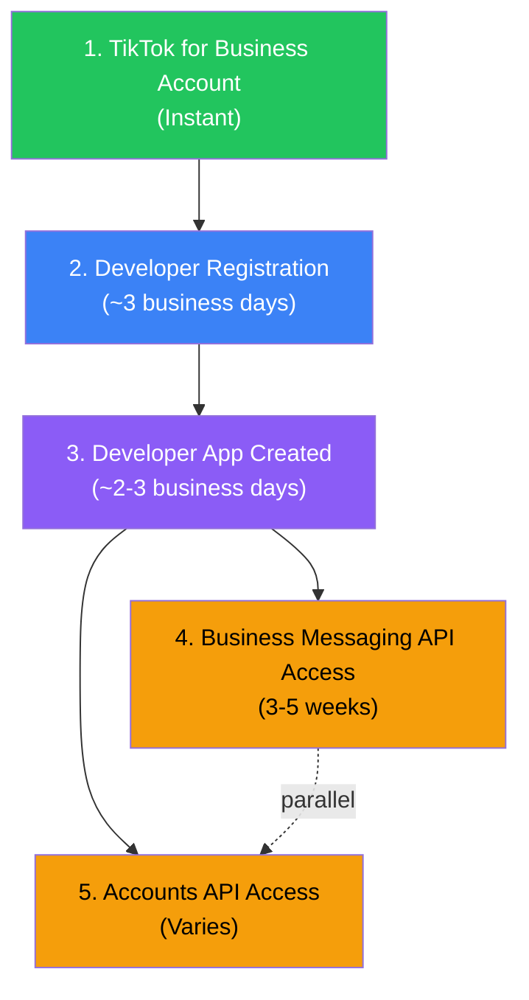
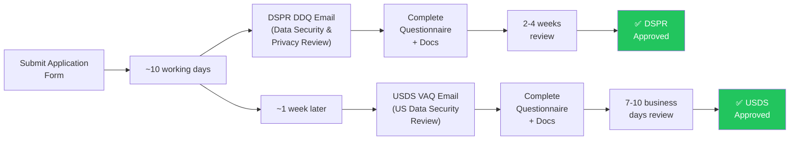

# TikTok Developer Access — Complete Deep Dive for SocialLift

## Your Situation

You want to build **SocialLift** — a SaaS platform where businesses connect their TikTok accounts and get an autonomous AI agent that handles DMs, comment replies, mention monitoring, and content scheduling. Before writing any code, you need **developer access** through TikTok's multi-layered approval system.

---

## The 5-Tier Access Ladder

Your access journey has **5 sequential tiers**. You cannot skip tiers — each unlocks the next.



> [!IMPORTANT]
> **Realistic total timeline: 4 to 8 weeks** from first signup to being production-ready with real customer business accounts.

---

## Tier 1: Create TikTok for Business Account (Instant)

**URL:** https://business-api.tiktok.com/portal → click registration button

### What you need:
- **Company domain email** (e.g., `developers+tiktok@wouchh.com`)
  - ❌ Gmail, Outlook, or any personal email will be **rejected**
  - ❌ Temporary/disposable emails will be rejected
- Password
- Agree to terms & privacy policy
- Verify via code sent to email/phone

> [!CAUTION]
> The email **must** be a company domain. If you don't have `@wouchh.com` or equivalent set up with email receiving, this is your first blocker.

---

## Tier 2: Register as a Developer (~3 business days)

**URL:** https://business-api.tiktok.com/portal → "Become a Developer"

### Critical form fields:

| Field | What to put |
|---|---|
| User type | **Technology Company** (you're building a SaaS) |
| Company name | **Wouchh** |
| Company website | Must be live, polished, on your company domain |
| Primary Developer Location | Where your dev team is located |

### Company website — strict requirements:
- ✅ Publicly accessible (no login wall)
- ✅ Fully developed, professional presentation
- ✅ Hosted on a domain owned by your company
- ✅ Domain must match the email domain
- ❌ No social media pages, third-party hosting, e-commerce platforms
- ❌ No shortened URLs
- ❌ No personal/individual websites

### Description template:
```
Wouchh is a technology company headquartered in [country], building SocialLift —
a SaaS platform that helps TikTok business accounts automate customer interactions.
We are the product and development team. We integrate TikTok's Business Messaging API,
Organic API, and Marketing API to provide business owners with autonomous AI agents
that handle direct messages, comment replies, and mention monitoring on their
authorized TikTok business accounts.
```

---

## Tier 3: Create the Developer App (~2-3 business days)

**URL:** https://business-api.tiktok.com/portal → "Create an App"

### App configuration:

| Setting | Value |
|---|---|
| App name | `SocialLift` |
| Intended Uses | See template below |
| Access Controls | "Shared with external business accounts who authorize via OAuth" |

### Redirect URL rules (very strict):
- ✅ Must be absolute, ending with `/`
- ✅ Must start with `https://`
- ❌ No `http://`
- ❌ No query parameters (`?`)
- ❌ No anchors (`#`)
- ❌ No ports (`:3000`)
- Length: 10–512 characters

**Example:** `https://app.sociallift.com/auth/tiktok/callback/`

### Scopes to request:

| Scope | Purpose | Which API |
|---|---|---|
| `user.info.basic` | Authenticated user identity | Accounts |
| `user.info.profile` | Profile metadata (bio, display name, avatar) | Accounts |
| `user.info.stats` | Follower count, etc. (lifetime totals) | Accounts |
| `user.info.username` | Get the @handle for dashboard, TikTok.me links | Accounts |
| `user.account.type` | Detect Business vs Personal account at OAuth | Accounts |
| `user.insights` | Daily metrics, follower growth, audience demographics | Accounts |
| `message.list.read` | Read DM inbox | Business Messaging |
| `message.list.manage` | Manage DMs | Business Messaging |
| `message.list.send` | Explicit send permission for DMs | Business Messaging |
| `comment.list` | Read comments on owned posts | Accounts |
| `comment.list.manage` | Reply/hide/delete comments | Accounts |
| `video.list` | List owned videos | Accounts |
| `video.publish` | Post content | Accounts |
| `video.insights` | Per-video analytics (reach, impressions, watch time) | Accounts |
| `biz.brand.insights` | Mention monitoring + brand insights | Organic |
| `biz.creator.insights` | Creator analytics | Organic |

### App logo:
- JPG/JPEG/PNG, max 512×512px
- **Required** — missing logo = OAuth error page for your users

> [!WARNING]
> The scopes involving "TikTok Accounts" permission require you to fill out the [Accounts API Access Application Form](https://bytedance.sg.larkoffice.com/share/base/form/shrlgu4WEvtSXpEDLcCw56u4Rfc) **before** submitting the app or requesting a scope increase (mandatory since March 20, 2026).

---

## Tier 4: Business Messaging API Access (3-5 weeks) ⭐ Critical

**This is the longest and hardest gate. It's also essential for SocialLift's core DM automation use case.**

**Application Form:** https://bytedance.sg.larkoffice.com/share/base/form/shrlg7vFArGhg9V20neYCEwIKrb

### Regional availability:
- ❌ **Not available** in EEA, Switzerland, UK
- ✅ Available in US (but requires extra US Data Security Review)
- ✅ Available in APAC, LATAM, METAP, North America

### Two-stage audit process:



### Documents to prepare BEFORE applying:

| Document | Purpose |
|---|---|
| **ISO 27001 certificate** | Information security management |
| **SOC 2 report** | Trust services (security, availability, confidentiality) |
| **Vulnerability scan report** | Recent infra security scan |
| **Penetration testing report** | Recent pen test results |
| **Privacy policy URL** | Public policy explaining data lifecycle |
| **Terms of service URL** | Public ToS for SocialLift |
| **GDPR / CPRA compliance docs** | If touching EU/CA data |
| **Data retention policy** | How long you store data |
| **Incident response policy** | How you handle breaches |

### Technical security requirements:
- [ ] Encryption at rest: **AES-256 or RSA-1024+**
- [ ] Encryption in transit: **TLS v1.2+**
- [ ] MFA enforced for admin access
- [ ] Network segmentation
- [ ] Endpoint protection (anti-virus, HIPS)
- [ ] Access control: need-to-know + least-privilege
- [ ] Regular vulnerability scans + pen tests
- [ ] Documented incident response plan
- [ ] Awareness training program

### USDS Restricted Countries (for US market access):
❌ Developers from these countries are **ineligible** for US market:
China (incl. Hong Kong), Russia, Iran, North Korea, Cuba, Syria

Also ineligible if >25% owned by entities from those countries.

> [!TIP]
> If your initial focus is APAC/LATAM/METAP, you can **skip the US review** for now and add it later. This significantly speeds up the process.

---

## Tier 5: Accounts API (Organic) Access

**Application Form:** https://bytedance.sg.larkoffice.com/share/base/form/shrlgu4WEvtSXpEDLcCw56u4Rfc

Required for any scope that includes "TikTok Accounts" permission (comment management, video listing, user info, etc.).

### Key difference from Marketing API auth:
- Auth code valid for **10 minutes only** (vs. 1 hour for Marketing API)
- Single-use only
- Exchange via `/tt_user/oauth2/token/` endpoint

---

## What SocialLift Can Actually Build (Feasibility Matrix)

### ✅ Fully Supported Features

| Feature | How |
|---|---|
| **Business OAuth login** | OAuth 2.0 with TikTok account holder authorization URL |
| **Auto-reply to comments on own posts** | `comment.update` webhook (5min) → `/business/comment/create/` |
| **Auto-reply to mentions in comments** | `brand.mention.event` webhook (2-3hr) → pull context → reply |
| **Autonomous DM handling (user-initiated)** | `im_receive_msg` webhook (real-time) → `/business/message/send/` |
| **Real-time DM inbox with AI replies** | Full conversation history via `/business/message/list/` |
| **Schedule and post content** | `/v2/post/publish/video/init/` with `FILE_UPLOAD` or `PULL_FROM_URL` |
| **Unified inbox (comments + DMs)** | Combine comment and messaging webhooks |
| **Engagement analytics** | `/business/video/list/` metrics |
| **Welcome messages + Q&A templates** | `/business/message/auto_message/create/` |
| **TikTok.me short links → DM funnel** | Generate links with `ref` + `message` params |

### ❌ Not Possible

| Feature | Why |
|---|---|
| Auto-DM when someone tags in comment/post | Prohibited — user hasn't messaged first |
| Auto-DM new followers | No webhook + prohibited |
| Bulk follower list | No API endpoint exists |
| Public user profile lookup (bio, follower count) | No API endpoint exists |
| Comment on other people's posts | Can only manage comments on own posts |
| Access actual video files | Only thumbnails exposed |

### ⚠️ Regional Only

| Feature | Region |
|---|---|
| High-intent comment → DM | Vietnam, Indonesia, Thailand only |
| Click-to-Message ads | APAC + LATAM only |

---

## Authentication Architecture

```
Business clicks auth URL → TikTok consent screen → Redirect with auth_code
     ↓
POST /tt_user/oauth2/token/ (auth_code → access_token + refresh_token)
     ↓
access_token expires in 24 hours
     ↓
POST /tt_user/oauth2/refresh_token/ (refresh_token → new access_token)
     ↓
refresh_token expires in 1 year → user must re-authorize
```

### Rate Limits (Basic tier, default):
- **10 QPS** / **600 QPM** / **864,000 QPD**
- Business Messaging API: fixed at **10 QPS**
- Sandbox: **1 QPS** / **30 QPM** / **1,000 QPD**

### Messaging Windows:
| Situation | Limit |
|---|---|
| Within 48hrs of user's first message | Up to 10 messages from business |
| User replies — active conversation | Unlimited for 48hrs after last user reply |
| User inactive 48+ hours | Max 3 messages until user responds again |

---

## 🎯 Your Immediate Action Plan

### Phase 1: Prerequisites (Do RIGHT NOW, before any signup)

- [ ] **1. Company domain email** — Set up `developers+tiktok@wouchh.com` (or equivalent)
- [ ] **2. Public-facing website** — Must be live, polished, on `wouchh.com`, with matching email domain
- [ ] **3. Privacy policy** — Published at a public URL on your domain
- [ ] **4. Terms of service** — Published at a public URL on your domain
- [ ] **5. App logo** — 512×512 PNG/JPG ready
- [ ] **6. OAuth callback URL decided** — e.g., `https://app.wouchh.com/auth/tiktok/callback/` or `https://app.sociallift.com/auth/tiktok/callback/` (HTTPS, no ports, ending with `/`)
- [ ] **7. Start SOC 2 / ISO 27001 process** — Even "in progress" helps with the DSPR review
- [ ] **8. Confirm encryption** — AES-256 at rest, TLS 1.2+ in transit in your stack

### Phase 2: Signup Sequence

```
Day 0:   Create TikTok for Business account              [instant]
Day 0:   Submit developer registration                   [wait 3 business days]
Day ~3:  Developer approved → Create developer app       [wait 2-3 business days]
Day ~6:  App approved → Submit Business Messaging API form
Day ~6:  Submit Accounts API form (in parallel)
Day ~6:  Create sandbox → start building in sandbox
Day ~16: Receive DSPR DDQ email → fill out + attach docs
Day ~23: Receive USDS VAQ email (if US) → fill out + attach docs
Day 30+: Approvals → go to production
```

### Phase 3: While Waiting for Approvals (Build in Sandbox)

Once your app is approved (Day ~6), you can:
1. Create a sandbox ad account
2. Generate sandbox access token
3. Build and test against `https://sandbox-ads.tiktok.com/open_api`
4. Test OAuth flows, webhook handling, comment/DM logic
5. Sandbox mock data covers: 2020-12-08 to 2020-12-19

---

## Key URLs

| Purpose | URL |
|---|---|
| Business Developer Portal | https://business-api.tiktok.com/portal |
| My Apps Dashboard | https://ads.tiktok.com/marketing_api/apps/ |
| Business Messaging API Application | https://bytedance.sg.larkoffice.com/share/base/form/shrlg7vFArGhg9V20neYCEwIKrb |
| Accounts API Application | https://bytedance.sg.larkoffice.com/share/base/form/shrlgu4WEvtSXpEDLcCw56u4Rfc |
| Postman Collection | https://www.postman.com/tiktok/workspace/tiktok-api-for-business/ |
| Production API base | `https://business-api.tiktok.com/open_api` |
| Sandbox API base | `https://sandbox-ads.tiktok.com/open_api` |

---

## Open Questions for You

> [!IMPORTANT]
> These will determine what to prioritize in your application:

1. **Do you have `@wouchh.com` email set up and receiving?** — This is blocker #1.
2. **Is a public-facing website already live on `wouchh.com`?** — This is blocker #2.
3. **Are privacy policy + terms of service pages published?** — Blocker #3.
4. **Which regions are your target customers in?** If not US, you can skip the USDS review and save 2+ weeks.
5. **Does Wouchh have any security certifications (ISO 27001, SOC 2) or pen test reports?** Even in-progress counts.
6. **What domain will your OAuth callback be on?** (e.g., `app.wouchh.com` or `app.sociallift.com`)
